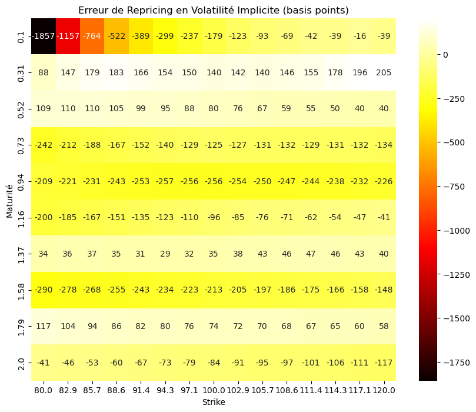

# HestonNet : Calibration du Modèle de Heston par Deep Learning

Ce projet implémente un réseau de neurones, "HestonNet", pour calibrer les cinq paramètres du modèle de volatilité stochastique de Heston à partir d'une surface de volatilité implicite.

L'objectif est de résoudre le problème inverse : étant donné une surface de volatilité observée sur le marché, trouver les paramètres du modèle de Heston (`v0`, `kappa`, `theta`, `gamma`, `rho`) qui la reproduisent le mieux.

Auteur : Alexis Schneider
LinkedIn : https://www.linkedin.com/in/alexis-schneider-a91079325/


---

### Surface de Volatilité : Originale vs. HestonNet


L'erreur de repricing moyenne est de l'ordre de **~250 basis points**, avec des erreurs plus importantes concentrées sur les maturités courtes et les strikes extrêmes, ce qui est un comportement attendu pour le modèle de Heston.

Voici une heatmap des erreurs :


---

---

## Méthodologie

Le pipeline de ce projet est structuré en trois étapes clés :

### 1. Génération de Données Synthétiques
Le dataset d'entraînement est généré à l'aide d'une **simulation de Monte-Carlo** robuste du modèle de Heston. Cette approche a été choisie pour sa stabilité numérique par rapport aux méthodes analytiques (FFT, COS) sur de larges plages de paramètres.
- Pour chaque jeu de paramètres aléatoires respectant la condition de Feller, une surface de prix d'options est simulée.
- La volatilité implicite est ensuite calculée pour chaque point de la surface.
- Seules les surfaces 100% valides (sans `NaN`) sont conservées pour former le dataset.

### 2. Normalisation et Préparation des Données
Une étape cruciale pour la stabilité de l'entraînement est la **normalisation** des données. Les surfaces de volatilité (entrées) et les paramètres Heston (sorties) sont normalisés sur une échelle de `[0, 1]` en utilisant `MinMaxScaler` de Scikit-learn.

### 3. Architecture et Entraînement du HestonNet
Le HestonNet est un réseau de neurones dense (MLP) construit avec TensorFlow/Keras.
- **Architecture :** Le modèle utilise plusieurs couches denses avec l'activation `ReLU`, des couches de `BatchNormalization` pour stabiliser l'apprentissage, et du `Dropout` pour prévenir le surapprentissage.
- **Fonction de Perte :** L'entraînement minimise l'erreur quadratique moyenne (MSE) entre les paramètres Heston normalisés prédits et les vraies valeurs.
- **Optimisation :** Des callbacks comme `EarlyStopping` et `ReduceLROnPlateau` sont utilisés pour garantir une convergence efficace.

---

## Comment Utiliser ce Projet

### Prérequis
Ce projet nécessite Python 3. Les principales bibliothèques utilisées sont :
- TensorFlow
- NumPy
- Scikit-learn
- Matplotlib
- tqdm
- py_vollib_vectorized

Vous pouvez les installer via pip :
```bash
pip install tensorflow numpy scikit-learn matplotlib tqdm py_vollib_vectorized
```

### Exécution
Le projet est contenu dans un unique Jupyter Notebook : `calibration_modele_Heston.ipynb`.
1.  Clonez ce dépôt.
2.  Lancez le notebook dans un environnement Jupyter.
3.  Exécutez les cellules séquentiellement pour :
    - Générer le dataset (Partie 1 & 2).
    - Entraîner le HestonNet (Partie 7).
    - Évaluer les résultats de calibration.


